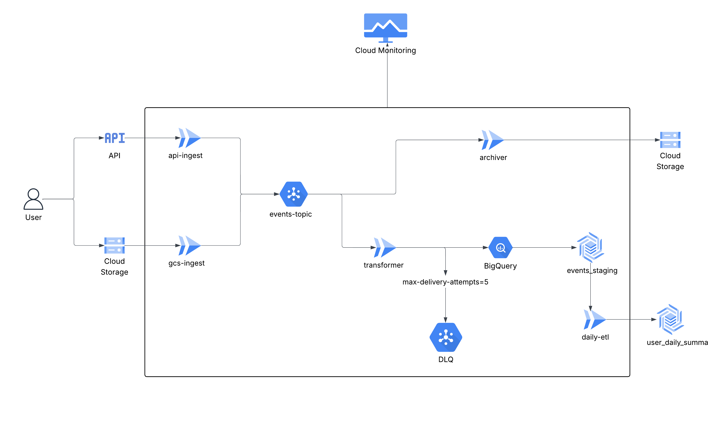

# Serverless E-Commerce Data Pipeline on GCP

A production-grade, event-driven data pipeline built entirely on Google Cloud Platform. This project ingests real-time e-commerce events, processes them via a fan-out Pub/Sub architecture, archives raw data, and loads transformed data into BigQuery for analytics. The entire infrastructure is deployed using Terraform and automated via a Cloud Build CI/CD pipeline.

## 🏗️ Architecture Overview

The pipeline consists of the following modular layers:

1. **Ingestion:** Two entry points accept data: an HTTP-triggered Cloud Function (`api-ingest`) for real-time events, and a Cloud Storage-triggered function (`gcs-ingest`) for bulk file uploads. Both publish to a central Pub/Sub `events-topic`.

2. **Processing (Fan-Out):**
   - **Archiver:** Subscribes to the topic and dumps raw, unmodified JSON events directly into a GCS archive bucket for disaster recovery.
   - **Transformer:** Subscribes to the topic, validates the schema, adds ingestion timestamps, and streams data into a BigQuery staging table.

3. **Safety Net (DLQ):** If the Transformer fails to process a message 5 times, it routes to an `events-dlq` Pub/Sub topic. A `dlq-logger` function logs these failed payloads to Cloud Logging.

4. **Analytics (ETL):** A scheduled Cloud Function (`daily-etl`) runs nightly to aggregate data from the staging table into a final, production BigQuery table using an idempotent `MERGE` SQL query.

5. **Monitoring:** A custom Cloud Monitoring dashboard tracks Pub/Sub message counts, Cloud Function errors, and BigQuery insertion rates.


---


## 🚀 Deployment Instructions

This project utilizes a fully automated CI/CD pipeline. **Manual infrastructure creation is strictly prohibited**; everything is managed via Git pushes.

### Prerequisites

- A Google Cloud Account and Project.
- `gcloud` CLI installed and authenticated.
- GitHub repository connected to Google Cloud Build.

### Step 0: Clone the Repository
 Before starting the setup, clone the project repository to your local machine.

 ```bash
 git clone https://github.com/Ravindra-Reddy27/e-commerce-data-pipeline.git
 cd e-commerce-data-pipeline
 ```


### Step 1: Initial GCP Setup

Enable the required APIs and create the remote Terraform state bucket:

```bash
# Enable the Resource Manager API
gcloud services enable cloudresourcemanager.googleapis.com --project=YOUR_PROJECT_ID

# Enable the Secret Manager API
gcloud services enable secretmanager.googleapis.com --project=YOUR_PROJECT_ID

# Create the remote state bucket
gcloud storage buckets create gs://YOUR_PROJECT_ID-tfstate --location=us-central1
```
Make sure the bucket name inside `provider.tf` is:

`bucket = "YOUR_PROJECT_ID-tfstate" `
  
### Step 2: Grant CI/CD IAM Permissions

Cloud Build acts as the Cloud Architect. Grant its default service account the necessary permissions to build infrastructure and assign roles:


#### Step 1 — Create Service Account
Create a service account for cloudbuild:
```bash
gcloud iam service-accounts create pipeline-admin-sa `
    --description="Service account for pipeline admin access" `
    --display-name="Pipeline Admin SA" `
    --project=YOUR_PROJECT_ID
```

#### Step 2 — Project IAM Admin *(Required)*

Allows Terraform to set IAM policies on any resource in the project.

```bash
gcloud projects add-iam-policy-binding YOUR_PROJECT_ID `
  --member="serviceAccount:pipeline-admin-sa@YOUR_PROJECT_ID.iam.gserviceaccount.com" `
  --role="roles/resourcemanager.projectIamAdmin" `
  --condition=None
```

#### Step 3 — Cloud Functions Admin

Allows Terraform to set IAM policies on Cloud Functions (`cloudfunctions.functions.setIamPolicy`).

```bash
gcloud projects add-iam-policy-binding YOUR_PROJECT_ID `
  --member="serviceAccount:pipeline-admin-sa@YOUR_PROJECT_ID.iam.gserviceaccount.com" `
  --role="roles/cloudfunctions.admin" `
  --condition=None
```

#### Step 4 — Pub/Sub Admin

Allows Terraform to set IAM policies on Pub/Sub topics and subscriptions.

```bash
gcloud projects add-iam-policy-binding YOUR_PROJECT_ID `
  --member="serviceAccount:pipeline-admin-sa@YOUR_PROJECT_ID.iam.gserviceaccount.com" `
  --role="roles/pubsub.admin" `
  --condition=None
```

#### Step 5 — Logging Writer

Write logs to Cloud Logging
```bash
gcloud projects add-iam-policy-binding YOUR_PROJECT_ID `
    --member="serviceAccount:pipeline-admin-sa@YOUR_PROJECT_ID.iam.gserviceaccount.com" `
    --role="roles/logging.logWriter" `
    --condition=None
```

#### Step 6 — Editor

Allow to Create resources, Update resources, Delete resources.

```bash
gcloud projects add-iam-policy-binding YOUR_PROJECT_ID `
    --member="serviceAccount:pipeline-admin-sa@YOUR_PROJECT_ID.iam.gserviceaccount.com" `
    --role="roles/editor" `
    --condition=None
```

### Step 3: Trigger the Pipeline

Whenever you push code to GitHub, this setup will automatically trigger, initialize safely from the remote bucket, deploy your architecture, and configure your DLQ.


Prerequisites:

Commit and push all your files to the `main` branch in the GitHub repository.

#### A. Link Repository
1. In the **Google Cloud Console**, navigate to **Cloud Build → Repositories**
2. Click **Link Repository**
3. Connect your **GitHub repo** and authorize access when prompted

####  B. Create Trigger

1. Go to **Cloud Build → Triggers → Create Trigger**
2. Fill in the following configuration:

| Field | Value |
|-------|-------|
| **Name** | `Give_trigger_name` |
| **Event** | Push to a branch |
| **Source** | Select your linked GitHub repo |
| **Branch** | `^main$` |
| **Service Account** | pipeline-admin-sa@YOUR_PROJECT_ID.iam.gserviceaccount.com |
| **Configuration** | Cloud Build configuration file (yaml or json) |
| **Location** | `/cloudbuild.yaml` |

3. Click **Create**


#### ✅ How It Works

Once the trigger is created, every push to your `main` branch will automatically:

- Initialize Terraform safely from the remote state bucket
- Plan and apply your full GCP architecture
- Deploy all Cloud Functions
- Configure Pub/Sub topics, subscriptions, and the DLQ
---

## 💻 Local Development & Testing

To test the Cloud Functions locally using the Functions Framework, you must supply mock environment variables.


```env
# .env.example
# GCP Configuration
GCP_PROJECT_ID="Your-project-id"
GCP_REGION="Your-region"

# BigQuery Configuration
BIGQUERY_DATASET="Your-bigquery-dataset-name"
BIGQUERY_STAGING_TABLE="Your-bigquery-staging-table-name"
```

---

## 🔐 Security & IAM

This pipeline strictly enforces the **Principle of Least Privilege**. Instead of a single master account, Terraform deploys three distinct service accounts:

| Service Account | Permissions |
|----------------|-------------|
| `ingestion-sa` | Can only publish to Pub/Sub (`roles/pubsub.publisher`) |
| `processing-sa` | Can subscribe to Pub/Sub, write to Storage, and insert into BigQuery |
| `etl-sa` | Only has permission to execute BigQuery jobs (`roles/bigquery.jobUser`) |

---

## 💰 Cost Optimization Strategy

BigQuery costs are driven by the amount of data scanned during queries. To minimize costs for the analytics team, the production table (`user_daily_summary`) utilizes two optimization techniques:

- **Time-unit Partitioning:** The table is partitioned by `event_date` (DAY). Queries filtering by a specific date range will only scan the data in those specific partitions, drastically reducing byte scanning costs.

- **Clustering:** The table is clustered by `user_id`. BigQuery automatically sorts the data blocks based on this column, making queries searching for specific users incredibly fast and cheap.

---

## 🧹 Teardown

To avoid incurring ongoing charges, destroy the infrastructure:


```bash
cd terraform
terraform destroy -auto-approve -var="gcp_project_id=YOUR_PROJECT_ID" `
-var="gcp_region=us-central1" `
-var="bigquery_dataset_id=events_dataset" `
-var="bigquery_staging_table_id=events_staging"
```
